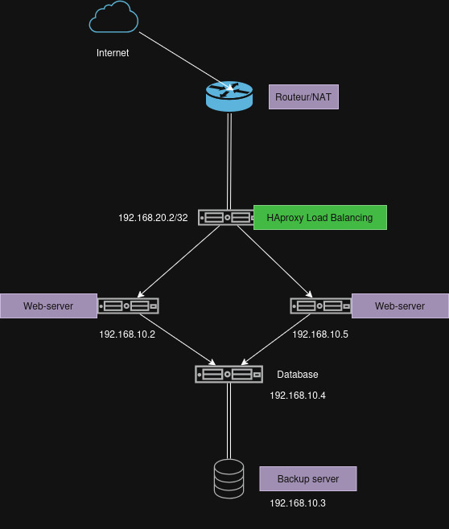
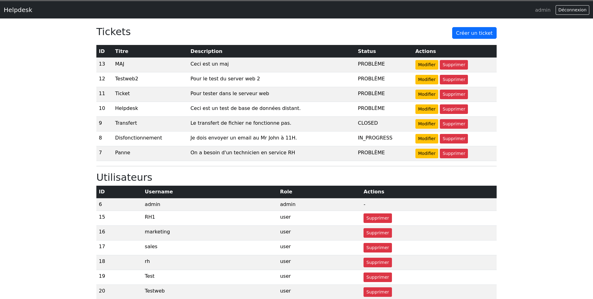
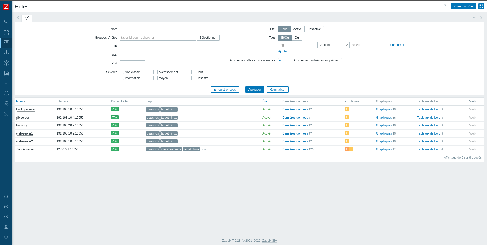
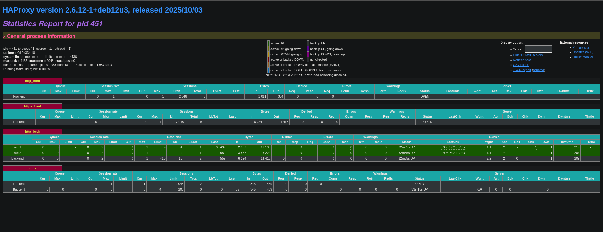
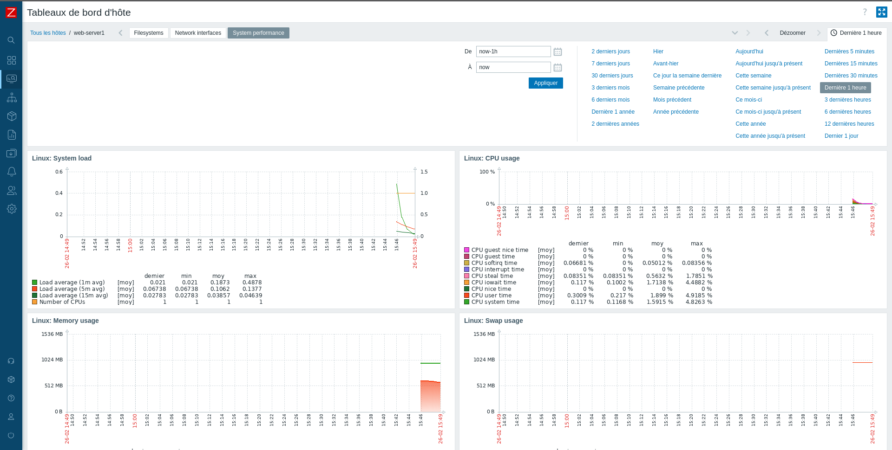
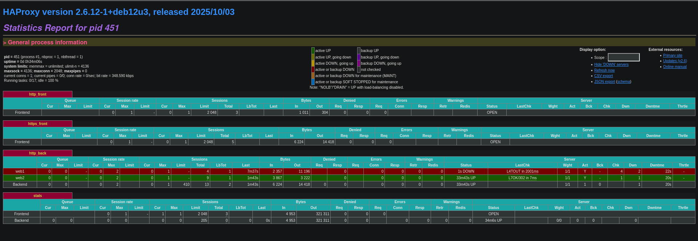

⚡ HAProxy High Availability Infrastructure
Automated & Monitored Web Architecture with Ansible
📌 Project Overview

This project demonstrates the design and automation of a production-like high availability infrastructure centered around HAProxy.

The infrastructure includes:

🔁 HAProxy Load Balancer

🌐 Two Nginx Web Servers

🐳 Dockerized Application

🗄️ Database Server

💾 Backup Server

🔐 SSH Hardening

🔒 HTTPS with Certbot

📊 Monitoring & Dashboards

🤖 Full automation with Ansible

The goal is to simulate a real SME (PME) infrastructure with resilience, supervision, and security best practices.

🏗️ Infrastructure Architecture
📷 Global Infrastructure


🔀 HAProxy Layer

HAProxy distributes incoming traffic using Round Robin algorithm and performs health checks on backend servers.

🔐 Security Layer
SSH Hardening

SSH key-based authentication

Password authentication disabled

Root login disabled

Security Role Includes

Firewall configuration

System updates

Service restrictions

Secure systemd service deployment (helpdesk.service)

🌐 Web Layer

Two Nginx servers deployed via Ansible:

Web Server 1

Web Server 2

Service Status


🐳 Dockerized Application

Application deployed inside Docker containers via Ansible role:

roles/docker/



Application preview:

🗄️ Database Layer

Database deployed and configured via:

roles/db/

Database monitoring dashboard:

📊 Monitoring & Supervision

Monitoring stack deployed automatically:

roles/monitoring/
Global Supervision


HAProxy Dashboard


Web Servers Monitoring



🚨 Failure Simulation

To validate high availability, a web server failure was simulated.

Normal Operation

Both servers active behind HAProxy.

## 🚨 Simulated Web Server Failure

✔️ HAProxy automatically removes failed server from backend pool.  
✔️ Traffic continues on remaining healthy server.  
✔️ No downtime observed.



This validates real High Availability behavior.

💾 Backup System

Backup automation implemented via:

roles/backup/

Cron configuration stored in:

config/cronjob.txt

Database backup is executed daily and logged.

🔒 HTTPS Implementation

Automated SSL certificate deployment using:

roles/certbot/

Automatic certificate generation

HTTPS redirection

Secure communication

🤖 Full Automation with Ansible

📁 Project Structure

```bash
.
├── config/
├── images/
├── inventory/
├── playbook.yaml
└── roles/
Roles Overview
Role	Purpose
base	Base system configuration
security	SSH hardening & system security
nginx	Web server installation
docker	Application container deployment
db	Database setup
haproxy	Load balancer configuration
monitoring	Metrics & dashboards
backup	Automated backup system
certbot	HTTPS certificate automation
🚀 Deployment

Clone repository:

git clone https://github.com/your-username/haproxy-ha-infrastructure.git
cd haproxy-ha-infrastructure

Run playbook:

ansible-playbook -i inventory/hosts.ini playbook.yaml

Infrastructure is fully deployed automatically.

🛠️ Technologies Used

Debian GNU/Linux

HAProxy

Nginx

Docker

PostgreSQL / MySQL

Ansible

Certbot

Systemd

Cron

Monitoring Stack

🎯 Skills Demonstrated

High Availability Architecture Design

Advanced HAProxy Configuration

Infrastructure as Code (IaC) with Ansible

Linux System Hardening

Service Orchestration

Monitoring & Observability

Backup Strategy Implementation

Failure Simulation & Resilience Testing

🏁 Conclusion

This project simulates a real-world SME infrastructure with:

Load Balancing

Automated Deployment

Security Hardening

Monitoring & Dashboards

Backup Strategy

Failure Recovery Validation

It demonstrates production-level thinking in system and network administration.